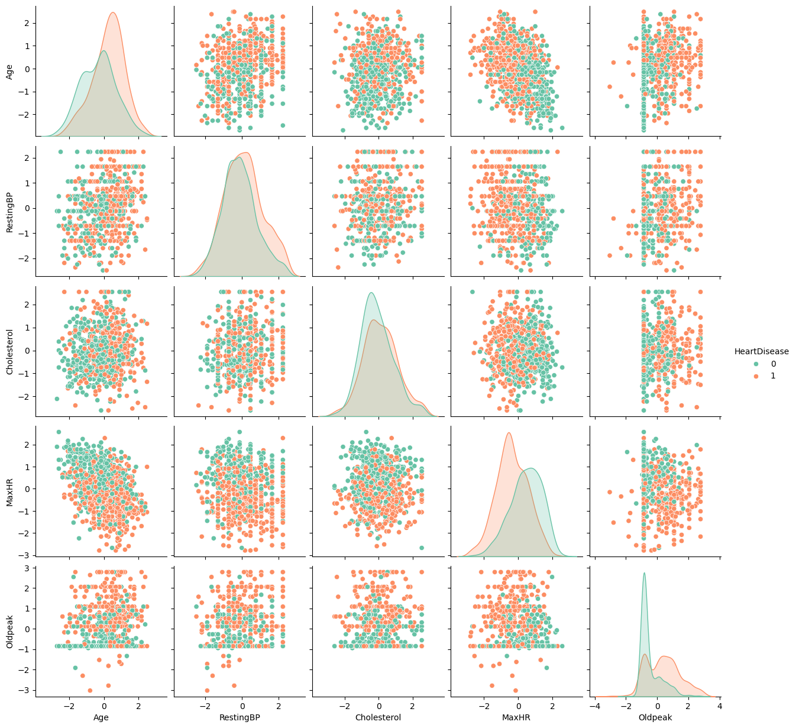
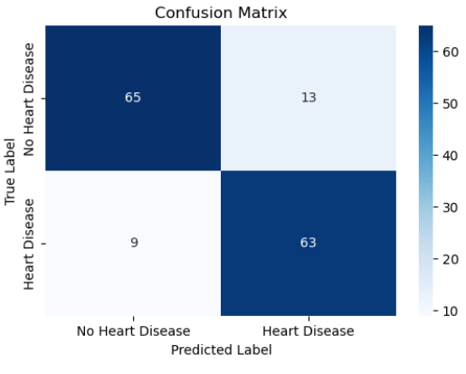
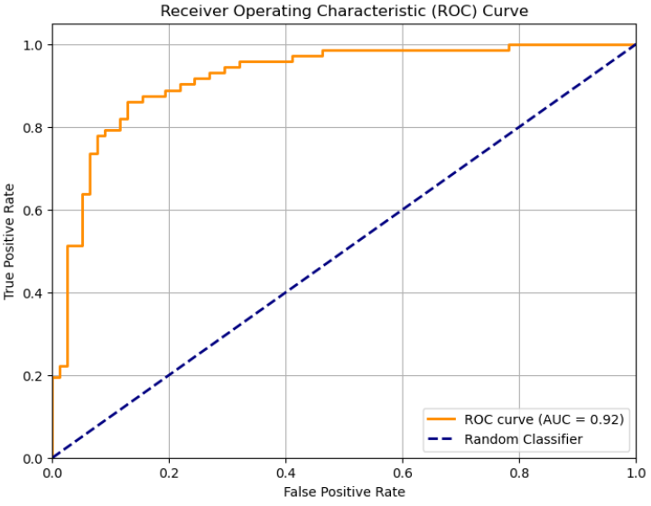
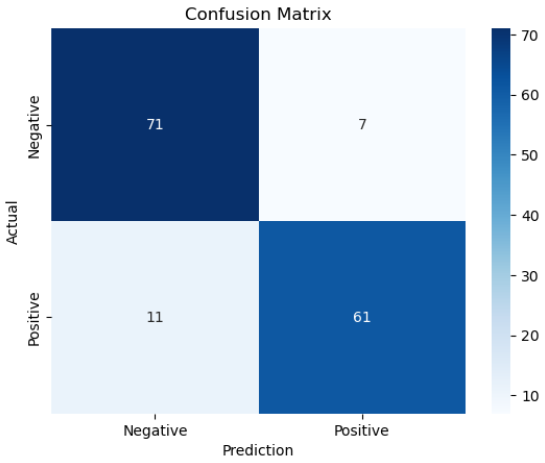
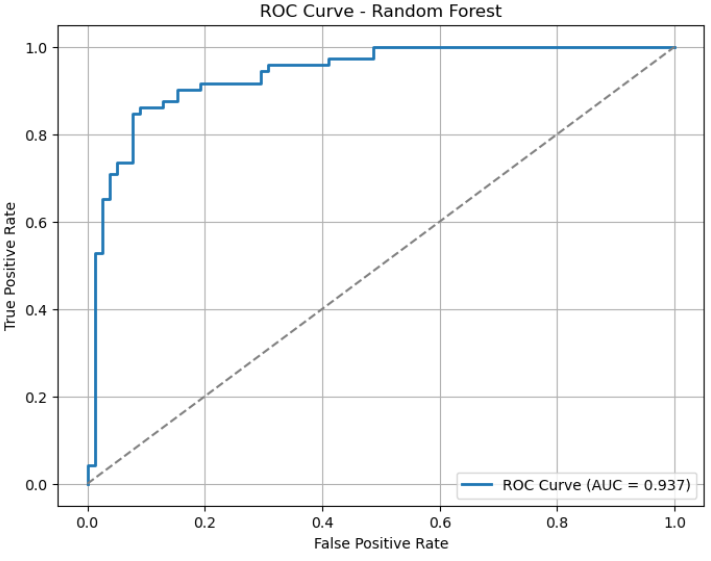
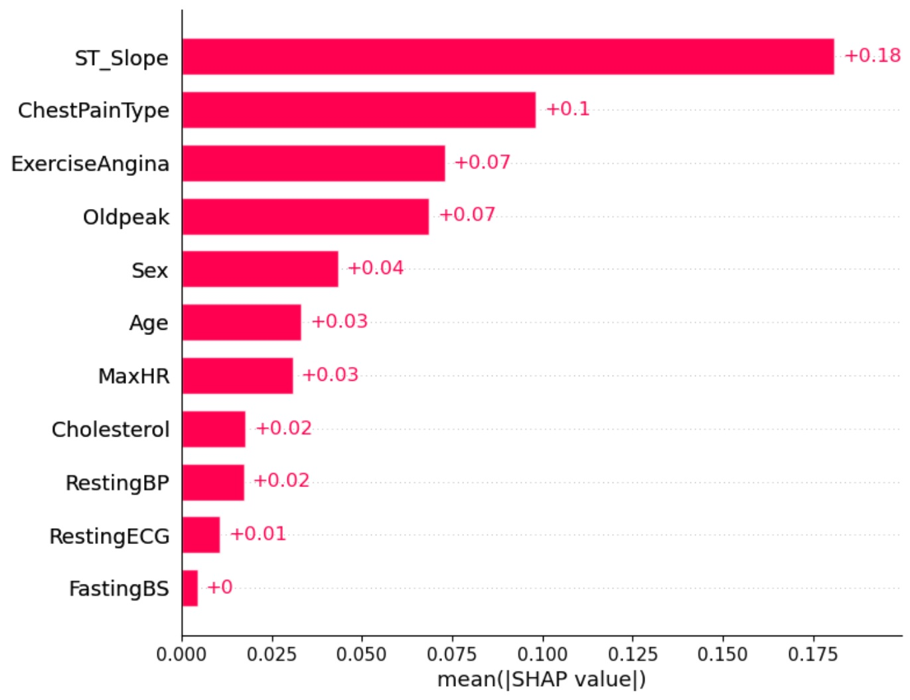
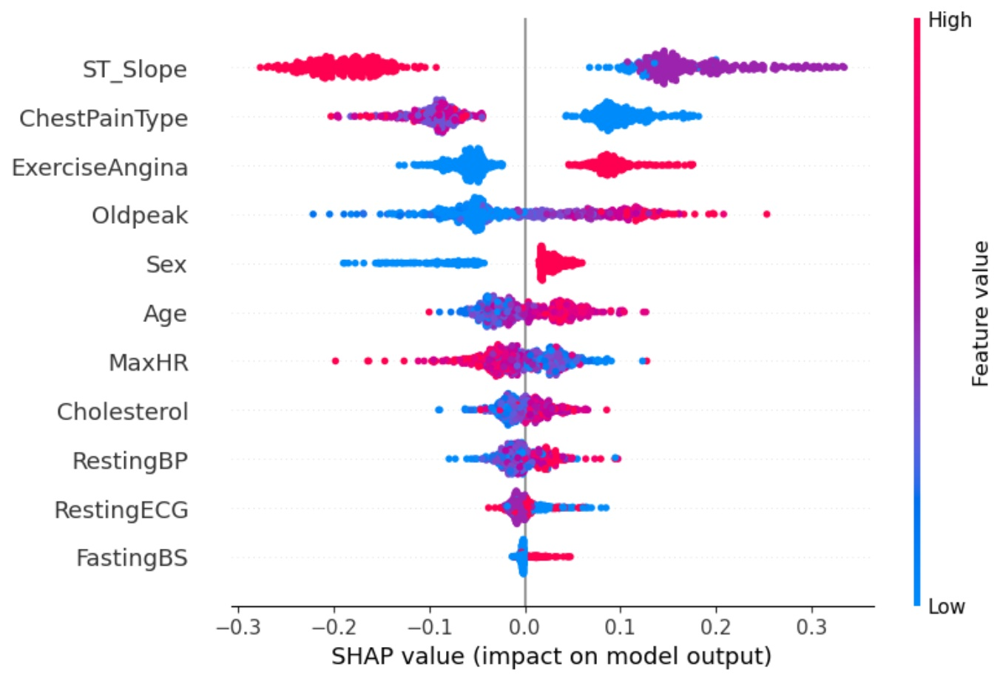
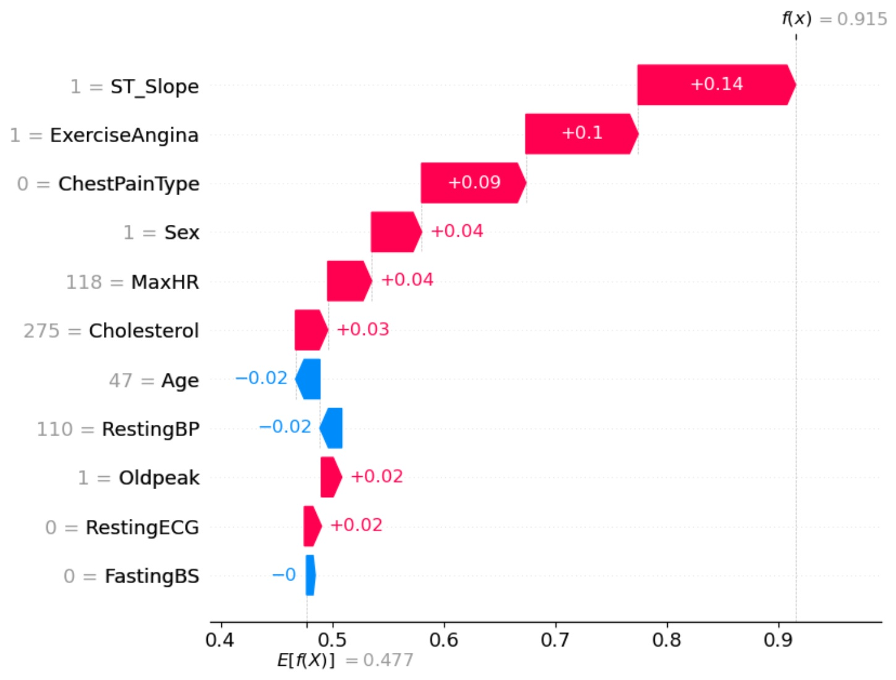
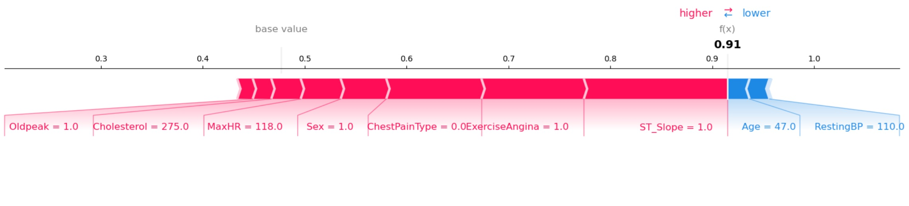

# HeartGuard ML: Detect risk before heart failure appear

## Data Sciences Institute, University of Toronto - Cohort 7 - ML Team 11

### Members (alphabetical)
* [Amy Li](https://github.com/lsmamy)
* [Chun-Yuan Chen](https://github.com/Chun-YuanChen) 
* [Isra Khan](https://github.com/Issy90)
* [Jaskirat Kaur](https://github.com/Jesscode-analyst)
* [Uma Deshpande](https://github.com/aniruma3012)
* [Yi-Chen Hsiao](https://github.com/yichen-hsiao)

### Collaboration
Please see [taskboard](taskboard)

## Abstract
**Objectives**: Develop machine learning models to identify important predictors of heart disease. **Methods**: Use the Heart Failure Prediction Dataset (918 observations) with preprocessing steps, exploratory data analyses, and models like Logistic Regression, Random Forest, and/or XGBoost. **Expected Outcomes**: Deliver a validated predictive model with a high performace that highlights influential features. **Significance**: The model will inform relevant stakeholders such as medical technology companies to design targeted interventions and improve heart disease prevention strategies.<br>

Keywords: heart failure, machine learning, classification<br>

## Overview
* [Business Case](#business-case)
* [Objectives](#objectives)
* [Project Roadmap](#project-roadmap)
* [Methods](#methods)
* [Results](#results)
* [Conclusion](#conclusion)
* [Reflection Videos](#reflection-videos)
* [Folder Structure](#Folder-Structure)

## Business Case
We are a machine learning team working on heart disease prevention. We support healthcare organizations, including hospitals, government agencies, and private companies developing heart disease prevention solutions, by identifying the key factors that predict heart failure, enabling them to design more effective interventions and products.<br>

### Stakeholders: 
* Medical Technology Companies<br>
* Hospitals<br>
* Government agencies<br>
* Pharmaceutical companies<br>

### Risks and uncertainties:
One major risk is overfitting, where models trained on such a small and specific dataset perform well on internal tests but fail on new, unseen data. Closely related is the risk of poor generalization, as the merged dataset may not represent all patient populations equally. There is also a bias risk if certain demographic groups, such as older adults, women, or underrepresented ethnicities, are not adequately represented, leading to unfair or inaccurate predictions for those groups.<br>

## Objectives
* Build a predictive classification model to identify the most significant demographic, clinical, and exercise-related features contributing to heart disease.<br> 
* Deliver a robust heart disease predictive model that enables stakeholders to develop products that drive profit, improve health management, support preventive medicine, enable screening of high-risk populations, and promote healthier diets within the food industry.<br>

## Project Roadmap


## Methods
### Dataset, features, and target 
We will use the Heart Failure Prediction Dataset from Kaggle to build machine learning models. This dataset contains 918 observations, 11 features (5 continuous and 6 categorical), and one target variable (categorical). The column names, types, descriptions, and values are detailed in the table below.

| Column Name     | Type        | Description                                           | Values / Units                                      | Risk Direction*         |
|-----------------|-------------|-------------------------------------------------------|-----------------------------------------------------|------------------------|
| HeartDisease    | Target: Categorical      | Diagnosis outcome                                     | 1 = heart disease,<br> 0 = normal                       | —                      |
| Age             | Feature: Continuous  | Patient’s age                                         | Years                                               | Age ↑                  |
| Sex             | Feature: Categorical | Biological sex                                        | M = male,<br> F = female                                | Male                   |
| ChestPainType   | Feature: Categorical | Type of chest pain                                    | TA = typical angina,<br> ATA = atypical angina,<br> NAP = non-anginal pain,<br> ASY = asymptomatic | TA or ATA        |
| RestingBP       | Feature: Continuous  | Resting blood pressure                                | mm Hg                                               | Higher values          |
| Cholesterol     | Feature: Continuous  | Serum cholesterol level                               | mg/dL                                               | Higher values          |
| FastingBS       | Feature: Categorical | Fasting blood sugar status                            | 1 = >120 mg/dL,<br> 0 = ≤120 mg/dL                      | 1                      |
| RestingECG      | Feature: Categorical | Resting electrocardiogram findings                    | Normal,<br> ST = ST-T wave abnormality,<br> LVH = left ventricular hypertrophy | ST or LVH              |
| MaxHR           | Feature: Continuous  | Maximum heart rate achieved                           | bpm (beats per minute)                              | Lower values           |
| ExerciseAngina  | Feature: Categorical | Presence of exercise-induced angina                   | Y = yes,<br> N = no                                     | Y                      |
| Oldpeak         | Feature: Continuous  | ST depression induced by exercise relative to rest    | mV (millivolts)                                     | Higher values          |
| ST_Slope        | Feature: Categorical | Slope of the peak exercise ST segment                 | Up = upsloping,<br> Flat = flat,<br> Down = downsloping     | Flat or Down           |

*This column indicates how each feature (direction) is theoretically associated with a greater likelihood of heart disease.<br>

Source: fedesoriano. (September 2021). Heart Failure Prediction Dataset. Retrieved [Date Retrieved] from https://www.kaggle.com/fedesoriano/heart-failure-prediction.<br>

### Environment & Dependencies
* Environment: Python (3.9.19), Jupyter Notebook (VS Code Integration)<br> 
* Python Libraries: pandas, numpy, random, sklearn, matplotlib, seaborn<br> 
* Version Control: Git/GitHub<br>

### Preprocessing
The dataset will be reviewed starting with data loading and inspection to understand its structure and identify inconsistencies. For handling missing values, the .isnull().sum() function will be used to locate gaps in the data. Outlier detection will be conducted using boxplots, z-scores, and the IQR method to identify and address extreme values. Finally, data normalization and scaling will be performed to bring all numerical features to a similar scale.<br>

**Data Cleaning**
- No null values found in raw data
- No duplicate values
- Abnormal values treated: 172 rows where 'Cholesterol = 0' was replace with Null
- Outlier Detection and Treatment
- Number of outliers capped:
  - Age: 0
  - RestingBP: 28
  - Cholesterol: 183
  - MaxHR: 2
  - Oldpeak: 16

### EDA
Exploratory data analysis will identify patterns, relationships, and trends in the dataset. It will begin with univariate analysis using summary statistics, histograms, and boxplots to understand individual variables. Bivariate analysis will then explore relationships between predictors and the target variable (HeartDisease) using bar charts, scatter plots, and boxplots. A correlation heatmap will measure linear relationships and detect multicollinearity, while pair plots will visualize feature interactions and reveal potential patterns or clusters.<br>

### Models

#### Model building
We aim to predict the presence of heart disease, which frames this as a supervised classification problem. We will establish a baseline using Logistic Regression before implementing more advanced model like Random Forest. A comparison of the model results will determine the necessity of exploring additional models. GridSearchCV will also be employed for optimization, as described in the model optimization section.<br>

#### Model Optimization & Cross-validation
In the later stages of development, the project will optimize both the baseline and advanced models through hyperparameter tuning. Model evaluation will be conducted using cross-validation techniques, specifically GridSearchCV.<br>

#### Model Testing & Performance Evaluation
During the testing phase, unseen data will be used for prediction. The final performance of both the baseline and advanced models will be assessed using key metrics, including accuracy, precision, recall, F1 score, and the ROC/AUC curve.<br>

#### Model comparison
At the conclusion of the testing phase, we will compare the performance of the baseline and advanced models across various evaluation metrics. Based on this comparison, the most effective model will be recommended to the client.<br>

#### Feature Importance
After model comparison (baseline vs. advanced), To analyze and determine the features for the model with better performance, we will use SHAP (SHapley Additive exPlanations) values to assess feature importance.<br>

### Limitations
The Heart Failure Prediction Dataset's dependability and generalizability are impacted by a number of limitations. With just 918 samples and 11 features, the model's complexity is limited and overfitting may result. Due to the fact that it combines data from five distinct sources, there can be inconsistencies as a result of numerous methods of collecting. Additionally, its limited ethnic variety and possible imbalances make it less typical of larger communities.<br>

## Results

### Preprocessing
- Original data has 918 entries (746 rows after abnormal values treated was used in model training)
- Data columns (total 12 columns: 11 features, 1 target variable)
- Age, Resting BP, Cholestrol, Fasting Blood Sugar, Max HR, Heart Disease - Integers ; OldPeak -Float
- Sex, ChestPainType, Resting ECG, Exercise Angina, ST_slope - Objjects converted to string

**Data Summary**
| Variable      | Count | Mean      | Std Dev   | Min  | 25%  | 50%  | 75%  | Max  |
|---------------|-------|-----------|-----------|------|------|------|------|------|
| Age           | 918   | 53.51     | 9.43      | 28.0 | 47.0 | 54.0 | 60.0 | 77.0 |
| RestingBP     | 918   | 132.40    | 18.51     | 0.0  | 120.0| 130.0| 140.0| 200.0|
| Cholesterol   | 918   | 198.80    | 109.38    | 0.0  | 173.0| 223.0| 267.0| 603.0|
| FastingBS     | 918   | 0.23      | 0.42      | 0.0  | 0.0  | 0.0  | 0.0  | 1.0  |
| MaxHR         | 918   | 136.81    | 25.46     | 60.0 | 120.0| 138.0| 156.0| 202.0|
| Oldpeak       | 918   | 0.89      | 1.07      | -2.6 | 0.0  | 0.6  | 1.5  | 6.2  |
| HeartDisease  | 918   | 0.55      | 0.50      | 0.0  | 0.0  | 1.0  | 1.0  | 1.0  |

### EDA

**Distribution of HeartDisease**

This bar plot shows the distribution of the target variable 'Heart Disease' across the dataset. As observed, the class distribution is highly balanced. 508 individuals have heart disease. 410 individuals do not have heart disease. 


**Distribution of the variables**
Most variable appear to be normally distributed, aside from old peak which is dominated by -1. Old peak is ST depression induced by exercise relative to rest

**Distribution of Categorical Variables**
- Sex
There are more females in the dataset.


- Chest Pain Type

In terms of chest pain type, most people do not have any chest pain. This is followed by non-angina chest pain, and then atypical chest pain. Very small smaple of 5% actually have typical chest pain.


- Resting ECG

In terms of resting ECG, most are normal. ST-T wave abnormality and left ventricular hypertrophy are similar in proportion.


- ST_Slope

In terms of ST slope, about half are flat. 43% are up and 6.9% are down.


**Distribution of Heart Disease Among Categorical Variables**

- There are more males with heart disease than those that did not. This is the opposite for female, where there are more without heart disease.
- There appears to be a lot more people who are asymptomatic who have heart disease than those that did not. This is perhaps not as suprising as one would expect as the dataset is for heartfailure and most patients with heartfailure do not have any symptoms
- There are more patients with exercise angina that have chest pain than those who do not.
- Most patients who do not have heart disease have upward ST slope. Most people with heart disease have flat ST slope.


**Correlation Analysis**

1. Age vs HeartDisease (0.28) - Weak positive correlation: older individuals have slightly higher risk of heart disease.
2. RestingBP vs HeartDisease (0.11) - Weak positive correlation: blood pressure has minimal linear association in this dataset. 
3. Cholesterol vs HeartDisease (0.08) - Cholesterol alone may not predict heart disease strongly here.
4. MaxHR vs HeartDisease (-0.4) - Moderate negative correlation suggesting higher maximum heart rate during exercise is associated with lower heart disease risk
5. Oldpeak vs HeartDisease (0.41) - Moderate positive correlation: more ST depression during exercise (Oldpeak) is associated with higher risk.


- Pairplots


### Model Training Summary


#### Baseline model

Pipeline


We used Logistic Regression as our Baseline model and the results on the testing data were:
- Accuracy: 0.85
- AUC Score: 0.92
- F1 Score: 0.85

The Logistic Regression model shows strong predictive power, with an AUC of 0.92 and an overall accuracy of 85.3%. It is slightly better at correctly identifying positive cases than ruling out negative cases.

Confusion Matrix:



ROC-AUC Curve:




#### Advanced model

Pipeline


We used Random Forest as our Advanced model and the results on the testing data were:
- Accuracy: 0.88
- AUC Score: 0.94
- F1 Score: 0.87

The Random Forest classifier is performing very well with an AUC of 0.94 and an accuracy of 88%. Contrary to logistic regression model, it demonstrates slightly better performance at correctly identifying negative cases (Specificity = 91.0%) than positive cases (Sensitivity = 84.7%), but both metrics are strong.

Confusion Matrix:



ROC-AUC Curve:



### Model comparison
We constructed two models for comparison: logistic regression and random forest. To ensure a fair evaluation, both models were trained using identical features and parameters, including 11 features, training set size, data shuffling, stratification strategy, and the number of cross-validation folds. Based on test set accuracy, the random forest model demonstrated superior performance.

### Feature importance
We utilized SHAP bar, beeswarm, waterfall, and force plots to visualize feature importance for the model with better performance.

#### Bar plot
The bar plot shows the mean absolute SHAP values for each feature we included in the model, which represent how much each feature contributes to the model's prediction of heart disease (class 1) versus normal (class 0) overall.



In the figure above, our better model relies most heavily on ST segment slope, chest pain type, and exercise-induced angina to distinguish between normal and heart disease cases. 

#### Beeswarm plot
The beeswarm plot displays individual SHAP values for each observation, allowing us to clearly see how each feature influences every participant in our dataset. The spread of SHAP values also indicates whether a feature affects individuals consistently or in varying ways.



In the figure above:
* ST segment slope: Individuals with a flat or downward slope of the peak exercise ST segment often face an obviously increased risk of heart disease. However, the wide spread of SHAP values across all observations indicates that the impact of this feature varies among individuals.
* Chest pain type: Asymptomatic pain is a risk indicator for heart disease. Other types, such as typical angina, tend to be associated with lower risk, possibly because they lead to earlier detection. The spread of SHAP values also shows some variability, suggesting that chest pain type interacts with other features.
* Exercise-induced angina: This feature demonstrates more consistent behavior than ST segment slope and chest pain type. When an individual experiences angina during exercise, the model consistently increases their predicted risk. However, there remains some variation in its impact across different individuals.

Interestingly, we note that in terms of SHAP value spread, sex shows a distinct pattern between men and women. Being male is associated with an increased risk, and this effect appears consistent across male participants. In contrast, being female tends to reduce risk, but the degree of this protective effect varies. This observation suggests the potential value of conducting subgroup analyses in future studies.

#### Waterfall plot and force plot
In contrast to the bar plot and the beeswarm plot above, the waterfall plot and force plot both focus on only one observation. Differently, the waterfall plot highlights how the SHAP score is built (which feature came first and how much it added), and the other shows how features push the score (which features had the strongest push/pull). We used observation 12 as an example of an individual with heart disease below.



In the figure above, we can see that for this observation, the final prediction is 0.915, suggesting that after accounting for all feature effects, the model predicts a pretty high risk of heart disease for this individual. The most influential risk factor is ST_Slope = flat, which contributes significantly to the prediction.



In the figure above, we can additionally get a sense of how strong that features' effect are, which is a pretty good quick review for this individual.


We also include another example (obs 36) without heart disease using the waterfall and force plots; please refer to the image folder for details.

## Conclusion
Logistic Regression was our Baseline model and the results on the testing data were: Accuracy: 0.85; AUC Score: 0.92; F1 Score: 0.85. We used Random Forest as our Advanced model and the results on the testing data were: Accuracy: 0.88; AUC Score: 0.94; F1 Score: 0.87. The Random Forest classifier is performing very well with an AUC of 0.94 and an accuracy of 88%. Contrary to logistic regression model, it demonstrates slightly better performance at correctly identifying negative cases (Specificity = 91.0%) than positive cases (Sensitivity = 84.7%), but both metrics are strong.
From our model training, we have learned that our better model relies most heavily on ST segment slope, chest pain type, and exercise-induced angina to distinguish between heart disease and no heart disease cases. Individuals with a flat or downward slope of the peak exercise ST segment face an increased risk of heart disease. However, the wide spread of SHAP values across all observations indicates that the impact of this feature varies among individuals. Asymptomatic pain is a risk indicator for heart disease, however this is limited usefulness as patients would not be able to know they have symptoms. The spread of SHAP values also shows some variability, suggesting that chest pain type interacts with other features. Exercise-induced angina demonstrates more consistent behavior than ST segment slope and chest pain type. When an individual experiences angina during exercise, the model consistently increases their predicted risk. However, there remains some variation in its impact across different individuals.

Risks and limitations:
Given the limited sample size, there is concerns around generalizability. Multi-source nature of the data source also can impact data quality. In addition, there are limited amount of features included. For example, lifestyle factors are known to be associated with heart disease. However, these are not included in the features list. 
With more time, our work could move to pilot testing. We would like to partner with hospital that have existing data to test our model with external datasets. We would then soft launch with hospitals, companies, medical technology companies to gather user feedback, refine the model. Following official launch, our goal would be to integrate into datasets so that it can be used in real time.


## Reflection Videos
The links currently point to YouTube as placeholders; please replace them with your own 3-5 minute video links once ready.

* [Amy Li](https://drive.google.com/file/d/16G6pfouyfh0vQgdSSxwZyvXCJqKaApSM/view?usp=sharing)
* [Chun-Yuan Chen](https://www.youtube.com/) 
* [Isra Khan](https://drive.google.com/file/d/1RFV8o9OJEZ4zOMUxIv2oh7El55yPBax2/view?usp=sharing)
* [Jaskirat Kaur](https://www.youtube.com/)
* [Uma Deshpande](https://drive.google.com/file/d/1t14aN286DeHEG6wY-fTDOCQcDKGd5tfw/view?usp=sharing)
* [Yi-Chen Hsiao](https://www.youtube.com/)

## Folder Structure

```markdown
.
├── data
├── images
├── models
├── taskboard
├── LICENSE
└── README.md
```

* **data**: Raw and processed datasets.
* **documentation**: Project timeline, action items, and related notes.
* **images**: Contains any images generated from EDA to modeling.
* **models**: Notebooks for preprocessing, EDA, baseline and advanced ML models, and feature importance; a pickle file for the best-performing model.
* **LICENSE**: Repository license information.
* **README.md**: Project overview, findings, and documentation.

